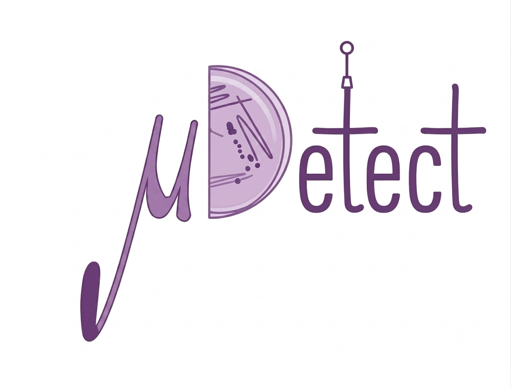
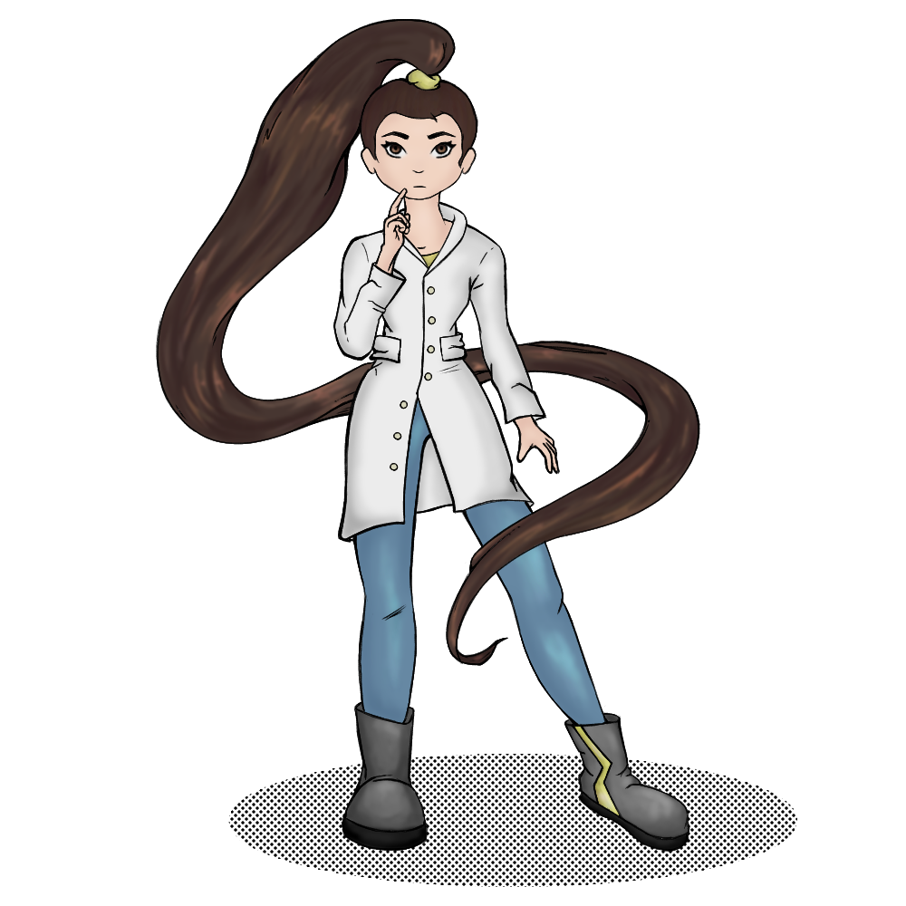

<div align="center">
  
  <h1>μKount & μDetect</h1>
  <p><em>AI-Assisted Microbiological Colony Analysis</em></p>
  <p>
    Eguzkiñe Diez-Martin<br>
    <a href="https://github.com/eguzki-dm"></a>
    <a href="https://orcid.org/0000-0002-7151-1639"></a>
    <a href="https://es.linkedin.com/in/eguzkine-dm"></a>
  </p>
</div>

---

**AGAR-Web** is a Streamlit-based web application that demonstrates a complete AI-assisted workflow for agar plate microbiological analysis. It combines computer vision and deep learning to detect, count, and classify microbial colonies — all from a single uploaded image.

> ⚠️ **Research prototype.** Not for clinical use.

---

## Workflow

```
Upload Image → μKount (Detection) → Crop & Preprocess → μDetect (Classification) → Results → Cuora (AI Assistant)
```

| Step               | Description                                                        |
| ------------------ | ------------------------------------------------------------------ |
| **📤 Upload**      | Drag & drop an agar plate image                                    |
| **🔍 μKount**      | YOLO-based colony detection with SAHI slicing inference            |
| **✂️ Crop + Prep** | Isolate each colony and apply Chan-Vese black background           |
| **🧪 μDetect**     | MobileNetV2 CNN species classification (5 bacteria/fungi)          |
| **📊 Results**     | Metrics dashboard, charts, species knowledge base, JSON/PDF export |
| **🧠 Cuora**       | AI assistant powered by Groq API — ask about your results          |

---

## Preview

<div align="center">
  <table>
    <tr>
      <td align="center"><br><b>μKount</b><br><em>Colony Detection</em></td>
      <td align="center"><br><b>μDetect</b><br><em>Species Classification</em></td>
    </tr>
  </table>
</div>

---

## Features

- **🎯 Colony Detection** — Real YOLOv8 detection via SAHI (Slicing Aided Hyper Inference)
- **🔬 Species Classification** — MobileNetV2 CNN trained on 5 species: _S. aureus_, _B. subtilis_, _P. aeruginosa_, _E. coli_, _C. albicans_
- **🎚️ Confidence Slider** — Adjust detection threshold before running μKount
- **🔍 Colony Zoom** — Expandable crop viewer per detected colony
- **📄 Export Results** — Download detections as JSON or full report as PDF
- **🧠 Cuora AI Assistant** — Conversational agent powered by Groq API, answers questions about your analysis
- **💡 Pipeline Tutorial** — Step-by-step guide togglable in the Pipeline page
- **🌐 Bilingual** — Full English / Spanish support (300+ translation keys)
- **📖 Species Knowledge Base** — Bilingual descriptions, Gram stain, morphology, risk group
- **📊 Results Dashboard** — Metrics, distribution charts, probability heatmap, per-colony tables

---

## Tech Stack

| Technology                                                           | Purpose                                                  |
| -------------------------------------------------------------------- | -------------------------------------------------------- |
| **[Streamlit](https://streamlit.io)** (≥1.36)                        | Web framework                                            |
| **[Ultralytics YOLOv8](https://github.com/ultralytics/ultralytics)** | Colony detection model                                   |
| **[SAHI](https://github.com/obss/sahi)**                             | Slicing Aided Hyper Inference for small object detection |
| **[TensorFlow](https://www.tensorflow.org)** / MobileNetV2           | Species classification CNN                               |
| **[OpenCV](https://opencv.org)**                                     | Image preprocessing (Chan-Vese, Otsu, morphological ops) |
| **[Plotly](https://plotly.com)**                                     | Interactive charts and heatmaps                          |
| **[fpdf2](https://github.com/PyFPDF/fpdf2)**                         | PDF report generation                                    |
| **[Groq API](https://groq.com)**                                     | Cuora conversational AI backend                          |
| **Python** (≥3.11)                                                   | Language                                                 |

---

## Quick Start

```bash
# 1. Clone the repository
git clone https://github.com/eguzki-dm/agar-web.git
cd agar-web

# 2. Install dependencies
pip install -r requirements.txt

# 3. (Optional) Add Groq API key for Cuora chatbot
echo "GROQ_API_KEY = \"your-key-here\"" > .streamlit/secrets.toml

# 4. Run the app
streamlit run app.py
```

The app will open at `http://localhost:8501`.

---

## Project Structure

```
agar-web/
├── app.py                  # Entry point + sidebar navigation
├── app_config/             # Centralized settings
├── pages/                  # 12 Streamlit pages
│   ├── 01_home.py          # Home page
│   ├── 02_fundamentals.py  # Project overview
│   ├── 03_pipeline.py      # Processing pipeline + tutorial
│   ├── 04_kount.py         # μKount — colony detection
│   ├── 05_detect.py        # μDetect — species classification
│   ├── 06_results.py       # Results dashboard + export
│   ├── 08_future_features.py
│   ├── 09_disclaimer.py
│   ├── 10_acknowledgments.py
│   ├── 11_cuora.py         # Cuora AI assistant
│   ├── 12_faq.py
│   └── 13_about.py         # Technical details
├── services/               # Business logic
│   ├── detection_service.py     # YOLO + SAHI detection
│   ├── classification_service.py # CNN classification
│   ├── preprocessing_service.py # Chan-Vese pipeline
│   └── pdf_report.py            # PDF generation
├── components/             # Reusable UI components
│   ├── cards.py
│   ├── charts.py
│   └── image_viewer.py
├── data/                   # species_info.json (bilingual knowledge base)
├── locales/                # i18n dictionaries (en.py, es.py)
├── utils/                  # Session state, i18n helper
├── icons/                  # Branding icons
│── .streamlit/             # Streamlit Cloud config
└── requirements.txt
```

---

## Meet Cuora 🧑‍🔬

<div align="center">
  
</div>

**Cuora** is the virtual microbiologist of AGAR-Web. She answers your questions about colonies, species, and lab techniques — making the app not just a tool, but a learning companion.

✅ **Implemented** — Powered by the **Groq API**, Cuora provides conversational assistance about your analysis results, detected species, and microbiological concepts.

---

## Roadmap

| Phase                                                        | Status      |
| ------------------------------------------------------------ | ----------- |
| **1 — MVP** Streamlit + mock services                        | ✅ Complete |
| **2 — μKount** Real YOLO detection                           | ✅ Complete |
| **3 — μDetect** Real CNN classification                      | ✅ Complete |
| **4 — Detection Filtering** Confidence threshold + zoom      | ✅ Complete |
| **5 — Cuora** AI assistant with Groq API                     | ✅ Complete |
| **6 — Export** JSON + PDF report download                    | ✅ Complete |
| **7 — More Species** Retrain model with additional organisms | 🔜 Planned  |
| **8 — Box Editing** Manual adjustment of bounding boxes      | 🔜 Planned  |
| **9 — Optimize SAHI** Improve slicing performance for dense agar plates | 🔜 Planned  |

---

## Resources

| Resource                | Reference                                                                                               |
| ----------------------- | ------------------------------------------------------------------------------------------------------- |
| **AGAR dataset**        | Majchrowska et al. 2021 · [DOI: 10.1038/s41598-021-02912-2](https://doi.org/10.1038/s41598-021-02912-2) |
| **Patch preprocessing** | Pawłowski et al. 2022 · [GitHub](https://github.com/jarek-pawlowski/microbial-dataset-generation)       |
| **YOLOv8**              | Ultralytics · [GitHub](https://github.com/ultralytics/ultralytics)                                      |
| **SAHI**                | Slicing Aided Hyper Inference · [GitHub](https://github.com/obss/sahi)                                  |

---

## Acknowledgments

This project was developed as the final applied project within the **LABORLAN 2026: IA & Data Tech (Artificial Intelligence and Technology Project Management)** program.

Special thanks to **[Aitor Donado](https://github.com/Aitor-Donado)** for his technical guidance and support, and to all my classmates who generously acted as the Spark Worker Nodes to process my thousands of images! ♥️

We also thank the teaching staff, mentors, and organizers of LABORLAN 2026 for their commitment and the learning environment that made this project possible.

---

## Author

**Eguzkiñe Diez-Martin** — 
[](https://github.com/eguzki-dm)
[](https://orcid.org/0000-0002-7151-1639)
[](https://es.linkedin.com/in/eguzkine-dm)

---

## Disclaimer

AGAR-Web is a **Proof-of-Concept research system**. Results are experimental and must **not** be used for clinical diagnosis, treatment decisions, or any medical purpose. Always validate microbial identification through standard microbiological methods.
